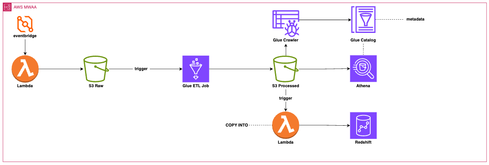

# ETL Contrataciones Pipeline

This project implements an end-to-end **ETL pipeline** for processing procurement (contrataciones) data using **Apache Airflow** locally and an **AWS-based architecture** for production.

## Overview

The pipeline extracts raw data, processes it, and makes it available for analytics and reporting. It is designed to be:

- Scalable
- Event-driven
- Cloud-ready
- Easily orchestrated with Airflow

---

## Architecture

### AWS Deployment Flow



## How to Run Locally

### 1. Start Airflow

```bash
airflow standalone
```
**This will start:**

- Webserver: http://localhost:8080

- Default user: admin
  
- Password stored in: `~/airflow/simple_auth_manager_passwords.json.generated`

### 2. Add DAG to Airflow

```bash
cp pipeline/pipeline.py ~/airflow/dags/pipeline_contrataciones.py
```

### 3. Verify DAG

```bash
airflow dags list
```

**If errors appear:**
```bash
airflow dags list-import-errors
```

### 4. Run DAG

#### Option A: UI

- Open http://localhost:8080
- Enable the DAG
- Click Trigger DAG

#### Option B: CLI

```bash
airflow dags trigger pipeline_contrataciones
```


